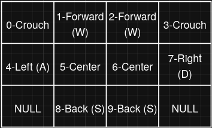

# Movement Pad Documentation

## Important Parts
- Force Sensitive Resistors, a form of potentiometer that changes resistance with applied pressure.  Purchased from [ddrpad.com](https://ddrpad.com/collections/fsr-sensors/products/force-sensitive-resistor-fsr-sensor-square-interlink?variant=39251885817908).
- Arduino Leonardo, as it supports the keyboard library.  
## Input Scanning 
The code scans through all 10 FSRs, and stores the state in an integer intended to be read in binary or hex.   If the analogue input of the FSR is above a specific threshold, defined in [conf.hpp](../include/conf.hpp). The number has a total of 10 bits that can change, the 10th bit corresponding to the FSR connected to A9, and the 1st bit corresponds to A0.  Below is a diagram that shows what FSR corresponds to what panel on the board, where the top of the diagram is front of the movement pad. (Side note, make sure the front and back are clearly distinguished from each other somehow).

